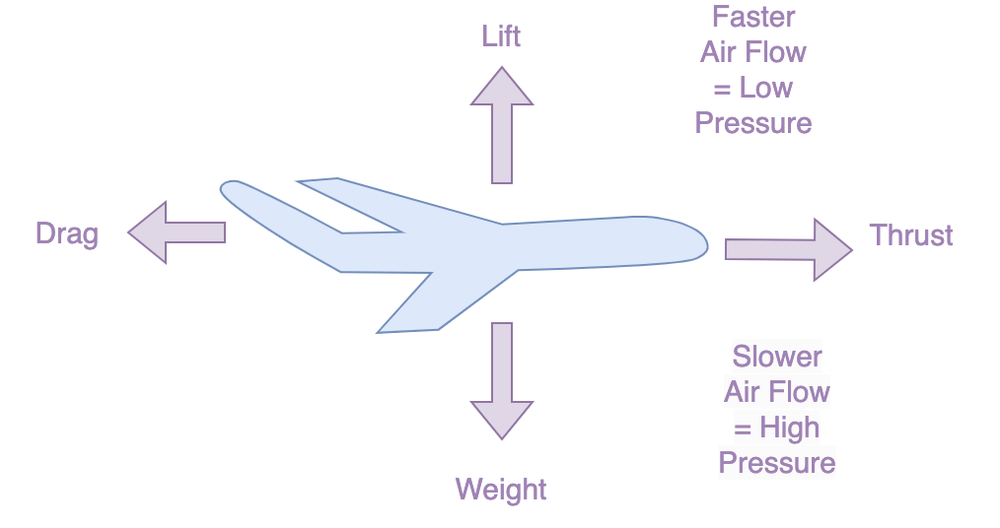

# Simulation of an Airfoil Lift Design

The airplane generates an airlift using its wings and its cross-sectional shape is called an airfoil.
The design of an airfoil depends on the specific characteristics that determine its aerodynamic performance. The optimization of these parameters helps designers create airfoils that meet specific performance requirements for various applications, such as aircraft wings, helicopter blades, and wind turbines.

## Overview

In this tutorial, we will create models for lifting an airfoil using equations of fluid dynamics. Then, we will analyze it by inserting uncertainties in various variables using [Signaloid Cloud Platform](https://docs.signaloid.io/docs/platform/#signaloid-cloud-developer-platform-1) and probability distribution methodologies.

## Methods to analyze an airfoil lift

You can analyze the lift of an airfoil by using the following two main methods in fluid dynamics and run them on the Signaloid Cloud Platform:

* [Bernoulli's equation](src/Bernoulli/README.md)
* [Lift equation (Panel method)](src/Plane_Method/README.md)

## Getting started

The [Signaloid Cloud Platform](https://signaloid.io/login/?r=signup) is designed to run and leverage several functions from the Signaloid libraries to handle uncertainty in input parameters. 

You need to run your source code snippets on Signaloid's processors to determine the airlift values of the airfoil. The code editor of the Signaloid Cloud Developer Platform allows you to quickly edit and run single-source-file applications using an in-browser version of the [Visual Studio Code](https://vscode.dev/) editor. In this repository, you can find the source codes for the following implementations:

* [Benoulli's equation](src/Bernoulli/src/bernoulli.c)
* [Lift equation](src/Plane_Method/src/plane_method.c)

For more information, see [Running Source Code with the Code Editor](https://docs.signaloid.io/docs/platform/getting-started/code/).

### Signaloid library 

Signaloid Cloud Platform uses the `uxhw.h` library for both of the calculation methods to facilitate high-performance computing tasks involving uncertainty quantification. For more information, see [Uncertainty Hexadecimal (“Ux”) Data Format](https://docs.signaloid.io/docs/hardware-api/ux-data-format/).

### Signaloid functions 

Signaloid Cloud Platform uses the following functions from the `uxhw.h` library for both of the calculation methods:

* **UxHwDoubleGaussDist**: generates a Gaussian (normal) distribution for air density (𝜌) and velocity (𝑣).

* **UxHwDoubleDistFromSamples**: generates a distribution based on empirical data for the lift coefficient (𝐶𝑙) and the area of the airfoil (𝐴).

* **UxHwDoubleUniformDist**: generates a uniform distribution for the mass of the airfoil (𝑚).

## Benefits

The following are some benefits offered by Signaloid Cloud Platform while solving airfoil lift equations:

* By using probabilistic distributions for inputs, you can simulate a range of possible outcomes, providing a better understanding of the variability in lift forces.

* The parallel processing allows efficient handling of simulations and complex calculations increasing the scalability.

* The accelerated computations ensure quicker execution and enhanced performance.

* You can analyze the probability density for each input and result using real-time graphs.