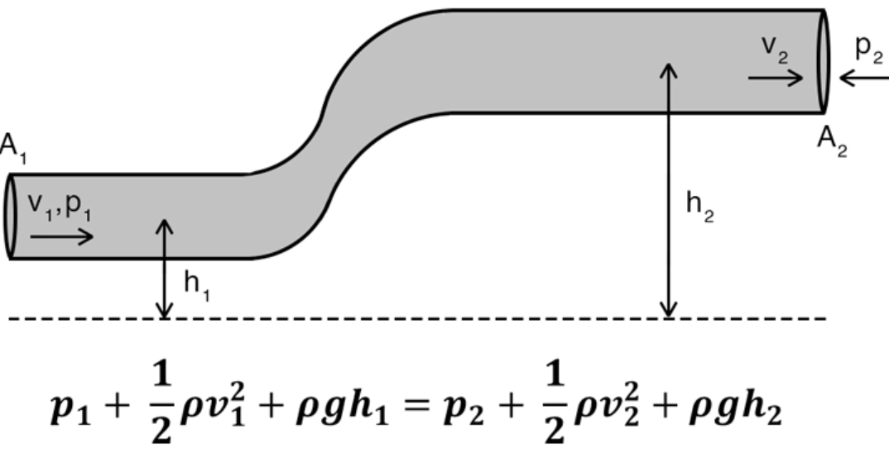
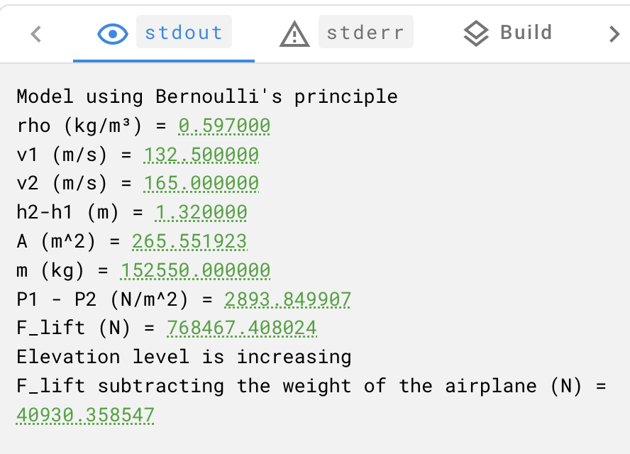

# Bernoulli's Equation
Bernoulli's equation is computationally efficient and allows you to calculate the lift forces. It is helpful in preliminary design phases and real-time applications such as flight simulations and controls. The lift of an airfoil depends on the difference between the pressure below the airfoil which is **P1** and the pressure above the airfoil which is **P2**. For more information, refer to this [link](https://en.wikipedia.org/wiki/Bernoulli%27s_principle).

| Relationship | Lift |
| ----------------- | ----------- |
| P1 > P2 | Upwards |
| P1 = P2 | No lift |
| P1 < P2 | Downwards |

[^1](https://www.sciencefacts.net/wp-content/uploads/2021/07/Bernoullis-Principle-Equation-Formula.jpg)

## Required inputs
You need to specify the following fields in Bernoilli's equation:

| Symbol | Stands for | Value Range |
| ------ | ------- |------- |
| `ρ` | Air density | 0.0316 - 1.2256 kg/m^3 |
| `g` | Acceleration due to gravity | 9.80665 m/s^2 (Constant) |
| `v1` | Velocity below the airfoil | 0 - 265 m/s |
| `v2` | Velocity on upper surface Airfoil | 0 - 330 m/s |
| `h2 - h1` | Thickness of the airfoil | 0.84 - 1.8 m |
| `A` | Area of airfoil | 51.18 - 817 m^2|
| `m` | Mass of an airplane | 85000 - 220100 kg |

The following is the description of all the above-mentioned inputs:

• `ρ`: It is the mass of air per unit volume. 

> **_NOTE:_**  Use the online [calculator](https://www.engineersedge.com/calculators/air-density.htm) for calculating the air density. 

You need to set the following values:

* Temperature of air constant: **15 Celsius**
* Humidity: **40%** 
* Atmospheric pressure: **29.9200 psi**
* Altitude: The maximum height of a commercial airplane is set from **0 ft** to **42,000 ft**.

• `g`: Acceleration due to gravity is around [9.80665 m/s^2](https://en.wikipedia.org/wiki/Gravitational_acceleration). It slightly varies with altitude from the center of the Earth.

• `v1` and `v2`: For commercial airplanes, speeds can reach up to **737 mph** or **330 m/s**. 

> **_NOTE:_** `v1` is kept slightly smaller in order to accommodate the mass of the airplane. For more information, refer to this [blog](https://www.flyingmag.com/guides/how-fast-do-commerical-planes-fly/).

• `h2 - h1`: The thickness of an airfoil can range from **0.84** to **1.8 meters**. 

• `A`: The area of the airfoil of most commercial aircrafts ranges from **51.18 meters** to **817 meters**. For more information, refer to this [link](https://en.wikipedia.org/wiki/Thickness-to-chord_ratio).

• `m`: The mass of an airplane can range from **85000 - 220100 kg**. For more information, refer to this [link](https://euflightcompensation.com/how-much-does-a-plane-weigh/). 

> **_NOTE:_** The private jets can have a mass even lower than **85,000 kg**.

## Calculate the airfoil lift

To calculate the airfoil lift, follow these steps:

1. To get the airlift, let's simplify the equation as follows by combining similar terms: 
    ```             
            ρ ⋅ pow(v2, 2)                    ρ ⋅ pow(v1, 2)
    P1 - P2 =  ______________  + (ρ ⋅ g ⋅ h2) -  ______________ -  (ρ ⋅ g ⋅ h1)
                    2                                2      
    ```
2. Dynamic pressure and potential energy terms are grouped as shown below:

    ```             
    P1 - P2 =    (ρ/2)⋅{pow(v2, 2) - pow(v1, 2)}  +  (ρ⋅g)⋅(h2 - h1)  
    ```
3. The result shows the pressure difference between the upper and lower surfaces of the airfoil which is influenced by the difference in velocities and height differences, multiplied by air density and gravity. 

4. To determine the actual lift force on an airfoil, you need to use the **Area (A)** of the airfoil using the following formulas:

    ```
    P = F / A
    ```

5. You can now find the value of **F_lift**.

    ```
    F_lift = A ⋅ (P1 - P2)
    ```
6. You can apply the Bernoulli equation and incorporate **Area** to **Find Lift Force**:

    ```
    A ⋅ (P1 - P2) = A ⋅ { (ρ/2)⋅{pow(v2, 2) - pow(v1, 2)} + (ρ⋅g)⋅(h2-h1) }  
    ```

    ```
    F_lift = A ⋅ { (ρ/2)⋅{pow(v2, 2) - pow(v1, 2)} + (ρ⋅g)⋅(h2-h1) }  
    ```
### Sample output

You can run the [sample code](../Bernoulli/src/bernoulli.c) on different input values. Here is an example of a sample output:



For more information, see [Running Source Code with the Code Editor](https://docs.signaloid.io/docs/platform/getting-started/code/).

• > **_INFO_:_** By using the functions from Signaloid's `uxhw.h` library, the platform incorporates uncertainty quantification into the calculations.

## Outputs
| Symbol | Stands for |
| ------ | ------- |
| `P1 - P2` | Difference of pressure between both surfaces of an airfoil (N / m^2) |
| `F_lift` | Lift force on an airfoil (N) |
| `F_lift_adjusted` | Lift force accounting for both the airfoils and the mass of the airplane (N) |

• > **_INFO_:_** **Elevation status** is calculated based on the adjusted lift force. This message indicates that the generated lift is greater or less than the weight of the airplane. 

## Reference

[^1]: https://www.sciencefacts.net/wp-content/uploads/2021/07/Bernoullis-Principle-Equation-Formula.jpg