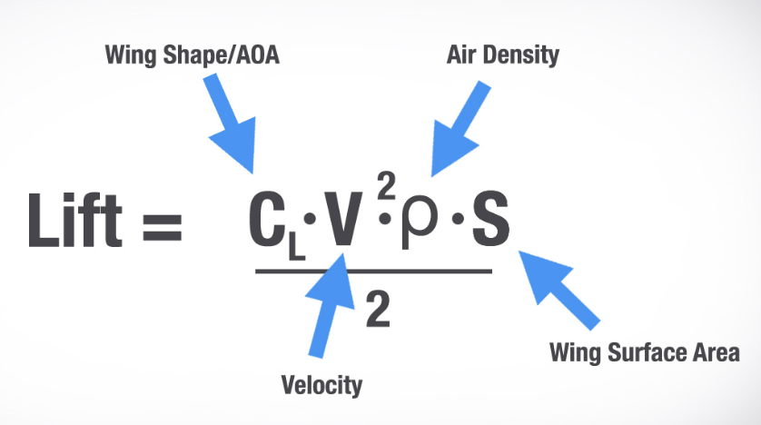
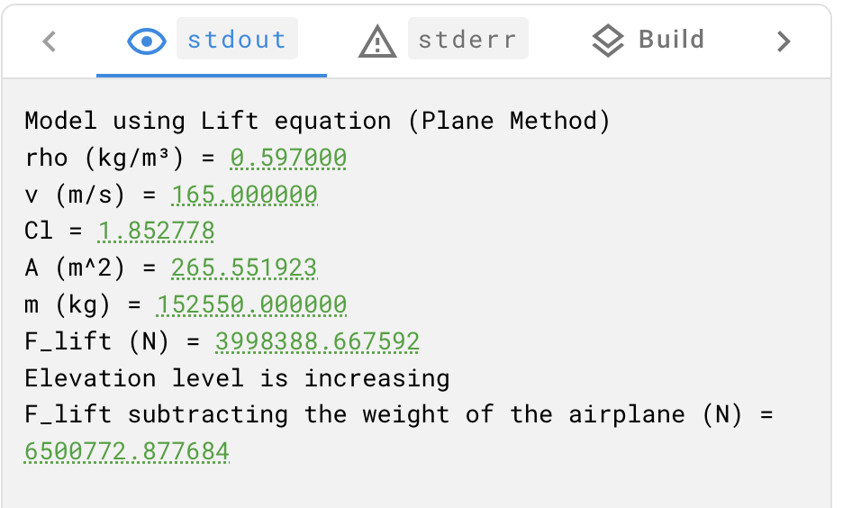

# Lift Equation (Panel method)
The Lift equation is used to calculate the lift force on an airfoil. It calculates the lift force based on key aerodynamic parameters. The lift depends on the density of the air, the square of the velocity, the air's viscosity, compressibility, the surface area over which the air flows, and the shape of the body.

[^1]

## Inputs

You need to specify the following fields in the Lift equation:

| Symbol | Stands for | Value Range |
| ------ | ------- |------- |
| `ρ` | Air Density | 0.0316 - 1.2256 kg/m^3 |
| `g` | Acceleration due to gravity | 9.80665 m/s^2 (Constant) |
| `v` | Velocity | 0 - 330 m/s |
| `Cl` | Lift coefficient | 1.2 - 3.3 | 
| `A` | Area of airfoil | 51.18 - 817 m^2|
| `m` | Mass of an airplane | 85000 - 220100 kg |

The following is the description of all the above-mentioned inputs:

• > **_INFO_:_** For the values of`ρ`, `g`, `A`, and `m` refer to the description of [Bernoulli's equation inputs](../../src/Bernoulli/README.md#inputs).

• `v`: You can use the maximum value for velocity because the Lift equation is independent of the air velocities above and below the airfoil. 

• `Cl`: The coefficient of lift (Cl) quantifies the lift generated by an airfoil or wing. For more information on the values of the maximum lift coefficient, refer to the [link](https://www.ae.utexas.edu/~varghesep/class/aircraft/Suggestions.pdf).

## Calculate the airfoil lift

To calculate the airfoil lift, follow these steps:

1. Use the following formula for dynamic pressure:
    ```
    1/2 ρv^2
    ```

2. Apply the Lift equation formula and substitute the values of `ρ`, `g`, `A`, and `Cl` into the Lift equation to calculate the lift force.

### Sample output

You can run the [sample code](../Plane_Method/src/plane_method.c) on different input values. Here is an example of a sample output:



For more information, see [Running Source Code with the Code Editor](https://docs.signaloid.io/docs/platform/getting-started/code/).

• > **_INFO_:_** By using the functions from Signaloid's `uxhw.h` library, the platform incorporates uncertainty quantification into the calculations.

## Outputs
| Symbol | Stands for |
| ------ | ------- |
| `F_lift` | Lift force on an airfoil (N) |
| `F_lift_adjusted` | Lift force accounting for both the airfoils and the mass of the airplane (N) |

• > **_INFO_:_** **Elevation status** is calculated based on the adjusted lift force. This message indicates that the generated lift is greater or less than the weight of the airplane. 

## Reference

[^1]: https://cdn.boldmethod.com/images/learn-to-fly/aircraft-systems/how-do-flaps-work/lift-equation-2.jpg

